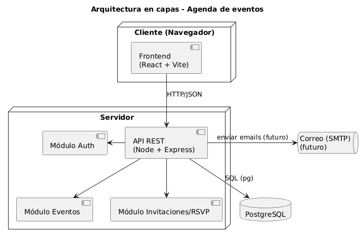

# Entrega 1 — Agenda de eventos con invitaciones
**Integrantes:** [tu nombre y grupo]  
**Fecha:** [dd/mm/aaaa]  
**Repositorio:** [URL del GitHub]

## 1. Historias de Usuario
(Ver archivo `entrega1_historias.md`)

## 2. Caso de Uso (UML)

## 3. Arquitectura propuesta
Texto explicativo...

