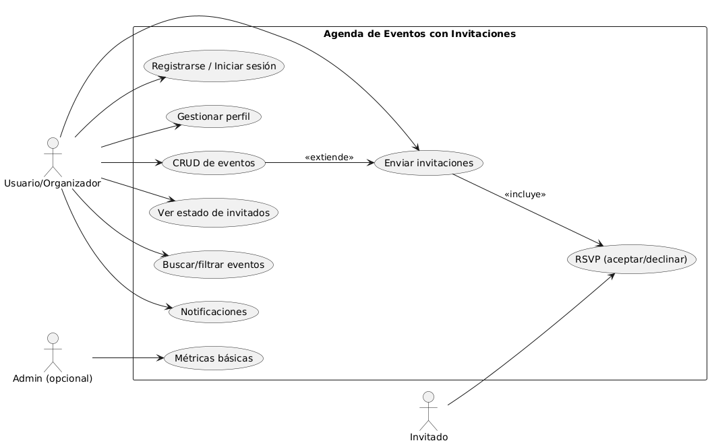
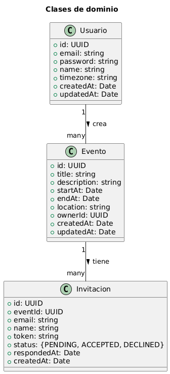
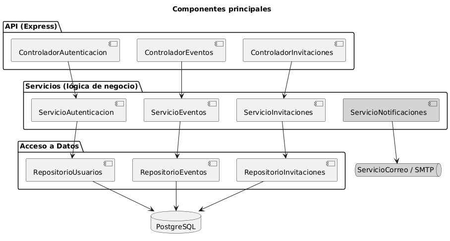
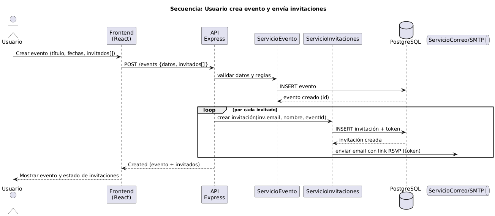

  

# Entrega 1 — Agenda de Eventos con Invitaciones

**Integrantes:**  
-Kevin Adrián Gil Soto (@kevingS0712)  
-Boris Guiillermo Briones Dupla  
-Fernando Moreno Mora  
-Rafael Alejandro Ajila Gallegos  

**Carrera:** Ingeniería de Software  
**Fecha:** [24/09/2025]  
**Repositorio Git:** https://github.com/kevingS0712/agenda-eventos

---

## 1. Introducción

El proyecto *Agenda de Eventos con Invitaciones* tiene como objetivo diseñar y desarrollar un sistema que permita a los usuarios **crear eventos, enviar invitaciones a participantes y registrar las respuestas (RSVP)** de los mismos.  

Este documento corresponde a la **Entrega 1: Diseño Arquitectónico y Principios de Software**, donde se definen los cimientos conceptuales del sistema:  
- Identificación de usuarios y funcionalidades.  
- Historias de usuario.  
- Diagramas UML (casos de uso, clases, componentes, secuencia).  
- Arquitectura propuesta.  
- Principios de diseño SOLID.  
- Patrones de diseño aplicados.  
- Consideraciones de seguridad y escalabilidad.  
- Evidencia de un repositorio con estructura real y código inicial.  

---

## 2. Justificación del proyecto

El sistema está pensado para que:  

- Un **organizador** pueda crear un evento, gestionar sus invitados y recibir las confirmaciones sin depender de procesos manuales.  
- Un **invitado** tenga un acceso simple, sin necesidad de registrarse, solo con un enlace único que le permita aceptar o rechazar la invitación.  
- Un **administrador** (opcional) pueda ver métricas generales, como el número de eventos creados o la tasa de aceptación de invitaciones.  

La idea es crear un aplicativo web **simple, práctico y confiable** que se base en buenas prácticas de software.  

---

## 3. Alcance del sistema

El sistema permitirá:  
- Crear, leer, actualizar y eliminar eventos (CRUD).  
- Enviar invitaciones a los participantes.  
- Confirmar o rechazar la invitación mediante un link (RSVP).  
- Consultar el estado de invitados (pendiente, aceptado, rechazado).  
- Mostrar métricas básicas de asistencia.  

No incluye todavía:  
- Pagos en línea.  
- Integraciones con calendarios externos.  
- Notificaciones en tiempo real.  

---

## 4. Historias de Usuario

1. Como **usuario**, quiero registrarme/iniciar sesión para gestionar mis eventos.  
2. Como **usuario**, quiero crear/editar/eliminar eventos para organizar mi agenda.  
3. Como **usuario**, quiero invitar personas por correo para obtener confirmación (RSVP).  
4. Como **invitado**, quiero abrir un enlace de invitación sin cuenta para aceptar/declinar rápidamente.  
5. Como **usuario**, quiero ver el estado de invitados (pendiente/aceptado/declinado) para tomar decisiones.  
6. Como **usuario**, quiero buscar/filtrar mis eventos por fecha/estado para encontrarlos rápido.  
7. Como **usuario**, quiero ver detalles de evento (fecha, lugar, notas) para compartir información clara.  
8. Como **usuario**, quiero recibir alertas cuando haya respuestas o cambios para mantenerme al día.  
9. Como **usuario**, quiero gestionar mi perfil (nombre, zona horaria) para personalizar la experiencia.  
10. Como **admin (opcional)**, quiero ver métricas básicas para monitorear uso.  

---

## 5. Diagramas UML y explicaciones

### 5.1. Caso de Uso
Representa las principales funcionalidades del sistema y la interacción de los actores.  

**Explicación:**  
- El organizador puede registrarse, manejar su perfil, crear eventos y enviar invitaciones.  
- El invitado solo necesita un enlace para responder (RSVP).  
- El administrador (opcional) puede consultar métricas globales.  
- Este diagrama refleja las **acciones más importantes** que ofrece la aplicación a cada tipo de usuario.  

---

### 5.2. Clases de Dominio
Modelo conceptual de las entidades principales del sistema.  

**Explicación:**  
- **Usuario:** representa al organizador que administra sus propios eventos.  
- **Evento:** contiene título, descripción, fechas y lugar.  
- **Invitación:** cada evento genera invitaciones, que tienen un estado y un token único.  

Este modelo de dominio nos ayuda a visualizar cómo se conectan los conceptos del sistema: *un usuario crea eventos, y un evento genera invitaciones*.  

---

### 5.3. Componentes
Muestra cómo se organiza el backend en módulos.  

**Explicación:**  
- Los **controladores** son la puerta de entrada: reciben las solicitudes de los usuarios.  
- Los **servicios** contienen la lógica del negocio (validar fechas, generar tokens).  
- Los **repositorios** se encargan de guardar y recuperar datos en la base de datos.  
- El **servicio de correo** (futuro) enviará notificaciones a los invitados.  

Este diagrama muestra cómo organizaremos el proyecto para mantenerlo ordenado y fácil de mantener.  

---

### 5.4. Secuencia
Flujo dinámico de mensajes entre actores y componentes.  

**Explicación:**  
Cuando un organizador crea un evento:  
1. El sistema valida los datos.  
2. Guarda el evento en la base de datos.  
3. Recorre la lista de invitados y crea invitaciones con tokens únicos.  
4. (Futuro) enviará un correo con el enlace RSVP.  
5. Finalmente, el organizador recibe una confirmación en pantalla.  

Este diagrama explica paso a paso lo que ocurre **detrás de cámara** cuando un usuario interactúa con el sistema.  

---

## 6. Arquitectura Propuesta

Usamos una **arquitectura en capas** porque separa las responsabilidades y facilita el mantenimiento:  

- **Capa de presentación:** el frontend (React), donde interactúan los usuarios.  
- **Capa de aplicación:** el backend (Express + Node.js), donde se manejan las reglas del sistema.  
- **Capa de datos:** la base de datos PostgreSQL, donde se guardan usuarios, eventos e invitaciones.  
- **Servicios externos:** como el correo electrónico, para enviar invitaciones.  

Esto nos permite que cada capa evolucione de manera independiente sin afectar a las demás.  

---

## 7. Principios SOLID aplicados

1. **Responsabilidad Única (SRP):** cada parte del sistema hace solo una cosa. Ejemplo: un repositorio solo accede a datos, un servicio solo contiene reglas de negocio. Esto evita confundirnos y facilita hacer cambios.  

2. **Inversión de Dependencias (DIP):** los controladores no dependen directamente de la base de datos, sino de servicios. Esto nos permite cambiar la forma de almacenamiento (ejemplo: pasar de PostgreSQL a MySQL) sin modificar el resto del código.  

3. **Abierto/Cerrado (OCP):** el sistema está abierto a nuevas funcionalidades (como agregar métricas avanzadas), pero cerrado a modificar lo ya existente. Así evitamos dañar lo que ya funciona.  

Estos principios son ideales porque hacen que el proyecto sea **modular, mantenible y escalable**.  

---

## 8. Patrones de diseño utilizados

- **Factory:** para crear objetos complejos, como una invitación con un token único. Nos permite centralizar la forma en que se generan invitaciones.  

- **Observer:** para el sistema de notificaciones. Cuando un invitado responde, el organizador puede ser notificado sin que tengamos que modificar el código principal.  

- **Singleton:** útil para la conexión a la base de datos. Necesitamos una sola instancia del gestor de conexión, y este patrón lo garantiza.  

Estos patrones son adecuados porque **resuelven problemas reales** del sistema: creación de objetos, comunicación entre módulos y gestión de recursos compartidos.  

---

## 9. Seguridad y Escalabilidad

- **Seguridad:**  
  - Las contraseñas se almacenarán cifradas.  
  - Los accesos de organizadores se validarán con tokens seguros.  
  - Se validará la entrada de datos para evitar ataques comunes.  

- **Escalabilidad:**  
  - La API está diseñada para ser ligera y stateless (fácil de escalar en la nube).  
  - La base de datos tendrá índices en los campos más consultados.  
  - Se prevé integrar un sistema de colas para enviar correos masivos.  

---

## 10. Evidencia del código

El proyecto ya cuenta con un backend básico en Express + TypeScript con endpoints de prueba:  

- **API viva**:  
    

- **Conexión a la base de datos**:  
    

---

## 11. Conclusiones

Con esta primera entrega hemos logrado:  
- Definir qué hará la aplicación y cómo se usará.  
- Identificar actores, funcionalidades y reglas de negocio.  
- Documentar con diagramas UML claros y explicados.  
- Aplicar principios y patrones de diseño adecuados al problema.  
- Construir un repositorio con estructura inicial y código mínimo en funcionamiento.  

Este trabajo nos da una buena base para continuar con la **Entrega 2**, donde buscamos implementar autenticación, gestión de eventos real y la interacción entre organizadores e invitados.  

---

## 12. Bibliografía

- Apuntes de clase (Unidades 1.2, 1.3, 1.4).  
- Sommerville, I. (2011). *Ingeniería de Software*. Pearson.  
- Gamma, E., Helm, R., Johnson, R., & Vlissides, J. (1994). *Design Patterns*. Addison-Wesley.  
- Documentación oficial de Express.js: https://expressjs.com/  
- Documentación oficial de PostgreSQL: https://www.postgresql.org/  

